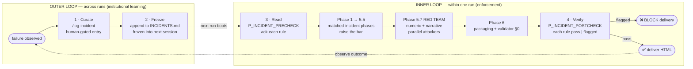

# Equity Research Skill

An **equity research** skill pack for AI assistants such as **ChatGPT**, **Claude**, and **Cursor**. Give a **company name** and/or upload **financial statement PDFs** (e.g. U.S. **10-K / 10-Q**, Hong Kong or A-share annual / interim reports).

This skill is built on the **Anamnesis Pattern** — cross-session institutional memory plus scheduled adversarial review. Every run reads `INCIDENTS.md` end-to-end before any work, fires a two-attacker red team after the data validator, and re-checks every accumulated rule before announcing delivery. A relapse on a known failure blocks the run; a clean draft survives.

**P0 gates (`SKILL.md` Step 0A.0):** Nothing else runs until (1) **report language** is **`en` or `zh`** per explicit cues in §0A.1 or the user's answer to the language question, and (2) when the **SEC EDGAR API** path applies, the user supplies a **real email** or **explicitly declines** — **no** `workspace/`, **no** Phase 1, **no** company research before that. Do **not** infer language from chat language alone. (See `INCIDENTS.md` I-001 for the load-bearing rule.)

**Locked HTML template:** Every run — public, private fund, hedge fund, family office, government entity, anything — fills the same SHA256-pinned skeleton in `agents/report_writer_{cn,en}.md`. There is **no** institution-compatible / private-company / scope-limited / simplified bypass. When issuer-level statements are unavailable, fill the locked sections with the best available proxies (AUM, strategy, top holdings, manager-level filings, peer macro) and label residual gaps inline. (See `INCIDENTS.md` I-002.)

**Report language:** If the user did not use an explicit phrase from **`SKILL.md` §0A.1**, the orchestrator asks the single English/Chinese question and **stops** until answered. Intermediate JSON and the final report match that language. **English** output: `{Company}_Research_EN.html` (header: English name + ticker only). **Chinese:** `{Company}_Research_CN.html`.

**US SEC API (optional path):** For **Mode A** + **US-listed SEC filer**, the orchestrator **must** prompt for email (or accept decline) per **`SKILL.md` Step 0A.2** before research — never assume `no email` without an explicit user decline.

The workflow collects data, runs financial and industry analysis, fires a two-agent red team, and produces **one interactive HTML research report** with a **Sankey revenue flow**, a **macro-factor waterfall chart**, and a **Porter Five Forces** radar — styled in an institutional-research palette (deep navy, deep forest green, wine red, amber, paper-toned background; serif headings, sans body).

**Porter score orientation:** Porter scores are threat / pressure scores, not attractiveness scores: **1-2 = low threat / green**, **3 = mixed / amber**, **4-5 = high threat / red**. Intense competitive rivalry should score high/red; minimal competition should score low/green.

**Repository:** [github.com/pppop00/Equity-Research-Company](https://github.com/pppop00/Equity-Research-Company)

---

## Methodology — the Anamnesis Pattern

The pattern closes a feedback loop most agent harnesses leave open. Two interlocking loops, plus an adversarial axis.



The four beats: **Curate · Freeze · Read · Verify** (CFRV).

| Beat | What happens | Where it lives |
|---|---|---|
| **1 · Curate** | A failure surfaces. A human runs `/log-incident <description>`. The model drafts a candidate entry from the latest workspace digest; the human confirms before append. | `.claude/commands/log-incident.md`, `tools/io/log_incident.py` |
| **2 · Freeze** | The entry appends to `INCIDENTS.md` and is loaded **verbatim** into the next session's system prompt at boot, alongside `MEMORY.md`. | `INCIDENTS.md`, `MEMORY.md`, `workflow_meta.json -> memory_files` |
| **3 · Read** | `P_INCIDENT_PRECHECK` reads `INCIDENTS.md` end-to-end and acknowledges each entry before any phase work. Phases that match an accumulated incident raise the bar. | `SKILL.md` §"P_INCIDENT_PRECHECK", `workflow_meta.json -> phase_definitions.phase_incident_precheck` |
| **4 · Verify** | `P_INCIDENT_POSTCHECK` re-reads `INCIDENTS.md` after Phase 6 and confirms each entry's detection signal is green. Output: `incident_postcheck.json`. **Any flagged entry blocks delivery.** | `SKILL.md` §"P_INCIDENT_POSTCHECK", `workflow_meta.json -> phase_definitions.phase_incident_postcheck` |

Plus the **5th axis** — scheduled adversarial review at **Phase 5.7**:

- `agents/attackers/red_team_numeric.md` — falsifies values, units, source chains, tolerance compliance, locked-template integrity carry-over.
- `agents/attackers/red_team_narrative.md` — falsifies hidden assumptions, missing counter-evidence, Porter directionality, prediction-waterfall coherence, locked-template integrity.

These are **distinct** from QC peers (`qc_macro_peer_*`, `qc_porter_peer_*`):

| | QC peers | Red-team attackers |
|---|---|---|
| Job | vote on agreement; weighted-average; flag deltas > tolerance | try to break the writer's claim; succeed when they find a defect |
| Output | score deltas → `qc_audit_trail.json` | challenge list with severity → `red_team_*_phase_5_7.json` |
| Loop budget | high (Phase 3.6 merge can incorporate dozens) | low (cap = 1 writer loop per phase) |
| Clean output is | suspicious — peers usually disagree on something | acceptable — a clean draft is a valid result |

A clean attacker output is valid; do not pressure the attackers to manufacture issues. Conversely, a draft that dismisses an attacker's critical finding without writing why is release-blocking.

For the full pattern definition (anti-patterns, applicability beyond equity research, required files), see `references/anamnesis_pattern.md`.

---

## What you get

- **Single deliverable (language-specific):** `{Company}_Research_CN.html` (zh) or `{Company}_Research_EN.html` (en) — open locally in a browser; light / dark theme toggle included; institutional-research palette.
- **Intermediate JSON:** financials (`financial_data.json`), macro factors with **`macro_regime_context`** (`macro_factors.json`), news intel, **`edge_insights.json`** (Agent 4: one evidence-backed "edge" for the summary), prediction waterfall, Porter analysis, **`qc_audit_trail.json`** in the standard full workflow after adversarial QC, and **`final_report_data_validation.json`** after the final data validation pass — easy to audit or pipe into other tools. `prediction_waterfall.json` is the final model source of truth for `company_specific_adjustment_pct`; when `company_events_detail[]` is present it should use the structured raw-to-final bridge fields (`raw_impact_pct`, timing / overlap / run-rate / probability / realization weights, `final_impact_pct`, `adjustment_reason`). `qc_audit_trail.json` may be absent only in intentionally shortened runs that explicitly skip QC.
- **Adversarial review artifacts:** `red_team_numeric_phase_5_7.json` and `red_team_narrative_phase_5_7.json` — every numeric and narrative claim in the locked-template HTML attacked by an independent prosecutorial agent.
- **Institutional-memory artifacts:** `incident_postcheck.json` per run — the post-delivery relapse detector against `INCIDENTS.md`. Append-only `INCIDENTS.md` at the repo root accumulates failure rules across runs.
- **Macro + summary depth:** **`macro_regime_context`** ties macro narrative to company role and cycle (not a second β table); **`edge_insights.json`** supplies the second investment-summary paragraph — both wired in **`SKILL.md`** and the listed agents.
- **Traceable process:** machine-readable contract in **`workflow_meta.json`** (with `phase_incident_precheck` first, `phase_5_7_red_team` between 5.5 and 6, and `phase_incident_postcheck` after 6) + orchestration in **`SKILL.md`**; sub-tasks in **`agents/`**; formulas and sector β tables in **`references/`**.

> **Note:** Final deliverable is either `*_Research_CN.html` or `*_Research_EN.html` per user choice. Agent instructions may mix English and Chinese; templates are locked separately in `agents/report_writer_cn.md` and `agents/report_writer_en.md`.

---

## Repository layout (after clone or download)

```
Equity-Research-Skill/
├── SKILL.md                 # ★ Start here — orchestration + boot order
├── MEMORY.md                # ★ Project invariants — frozen at session start
├── INCIDENTS.md             # ★ Append-only failure log — frozen at session start
├── README.md                # This file
├── CLAUDE.md                # Claude Code guidance + commands
├── workflow_meta.json       # ★ Machine-readable workflow contract (gates, phase order, packaging profiles, memory_files)
├── scripts/
│   ├── extract_report_template.py  # ★ Extract locked HTML fenced block from report_writer_*.md (Phase 5)
│   ├── sec_edgar_fetch.py          # SEC EDGAR API path (Mode A, US listings; user-agent comes from §0A.2)
│   └── validate_workflow_meta.py   # Validate workflow_meta.json schema
├── tools/
│   └── io/
│       └── log_incident.py         # /log-incident backend — collects workspace digest for INCIDENTS draft
├── tests/
│   ├── test_extract_report_template.py   # CN/EN extraction + CLI + SHA256 snapshot tests
│   ├── test_workflow_meta.py             # workflow_meta contract validation
│   └── test_intelligence_layer_contract.py
├── agents/
│   ├── report_writer_cn.md  # ★ Locked Chinese HTML template (institutional palette, serif headings)
│   ├── report_writer_en.md  # ★ Locked English HTML template (same structure)
│   ├── final_report_data_validator.md  # Phase 5.5 — final professional data validation
│   ├── report_validator.md             # Phase 6 — HTML structure / delivery checklist with §0 hard preconditions
│   ├── financial_data_collector.md
│   ├── macro_scanner.md
│   ├── news_researcher.md
│   ├── edge_insight_writer.md          # Non-obvious filing-backed insight → edge_insights.json
│   ├── qc_macro_peer_a.md / qc_macro_peer_b.md   # Adversarial QC on macro & prediction (vote on agreement)
│   ├── qc_porter_peer_a.md / qc_porter_peer_b.md # Adversarial QC on Porter (vote on agreement)
│   ├── qc_resolution_merge.md          # Merge QC challenges → updated JSON + qc_audit_trail.json
│   ├── logo_production_agent.md        # Optional Phase 5.2 — when card workflow is enabled
│   └── attackers/
│       ├── red_team_numeric.md         # ★ Phase 5.7 — adversarial numeric falsifier
│       └── red_team_narrative.md       # ★ Phase 5.7 — adversarial narrative falsifier
├── references/
│   ├── anamnesis_pattern.md            # ★ The methodology — incident loop + adversarial review
│   ├── prediction_factors.md           # Macro model: φ, β, formulas, sector regime / transmission notes
│   ├── porter_framework.md             # Porter Five Forces writing guide
│   ├── financial_metrics.md            # Metric definitions
│   ├── intelligence_layer.md           # Agent 3 / Agent 4 / Phase 2 / Phase 2.5 / Phase 6 wiring
│   ├── phase_execution_rules.md        # Detailed constraints for Phases 1–6
│   ├── report_style_guide_cn.md
│   └── report_style_guide_en.md
├── .claude/
│   └── commands/
│       └── log-incident.md             # /log-incident slash command spec — Curate beat
└── workspace/                          # Per-run outputs ({Company}_{Date}/, HTML + JSON; gitignored examples)
```

> **Do not** change the HTML/CSS/JS skeleton inside `agents/report_writer_cn.md` or `agents/report_writer_en.md`. Dynamic content is injected **only** via placeholders; see the rules at the top of each file.

**Auditable HTML generation:** To reproduce the locked skeleton without copying another company's finished report, run:

```bash
python3 scripts/extract_report_template.py --lang cn --sha256 -o workspace/MyCo_2026-04-08/_locked_cn_skeleton.html
# or: --lang en
```

Then replace `{{PLACEHOLDER}}` markers only. See `SKILL.md` Phase 5.

**Tests (template extract, Chinese + English, workflow contract, intelligence layer):**

```bash
python3 -m unittest discover -s tests -v
```

**Validate workflow contract only:**

```bash
python3 scripts/validate_workflow_meta.py --meta workflow_meta.json
```

If you change the fenced HTML inside `agents/report_writer_*.md`, update the expected SHA256 hashes in `tests/test_extract_report_template.py`.

---

## How to use (by product)

### Common steps

1. **Clone** (or download ZIP and extract):
   ```bash
   git clone https://github.com/pppop00/Equity-Research-Company.git
   cd Equity-Research-Company
   ```
2. Add this repo to your AI session **context** (folder upload, `@` workspace, or open the project locally). The host should load `MEMORY.md` and `INCIDENTS.md` into the model's working context at session start (Claude Code's project skill mount and Cursor's `.cursor/rules` both support this; for ChatGPT, paste them into the project knowledge).
3. Instruct the model to **follow `SKILL.md` strictly**, starting with `P_INCIDENT_PRECHECK` (read `INCIDENTS.md` end-to-end), then Step 0A. In Phase 5, generate HTML using the **locked template** in **`agents/report_writer_cn.md`** or **`agents/report_writer_en.md`** (match the report language resolved in **Step 0A**).
4. Provide a **company name** and/or **filing PDFs**. Suggested output folder: `workspace/{Company}_{Date}/`.
5. After delivery, if a failure mode emerges that is worth a permanent rule, run `/log-incident <one-line description>`. The model drafts an entry from the latest workspace digest; you confirm; the entry is appended to `INCIDENTS.md` and frozen into the next session's prompt.

### Cursor

- Open the directory containing **`SKILL.md`** as the workspace, or copy this repo into your project.
- Reference the skill in **Rules / Skills** (e.g. "for equity reports, read and execute `SKILL.md`; always read `MEMORY.md` and `INCIDENTS.md` at session start"). You may also copy key points into `.cursor/rules`.
- Example: `@SKILL.md Build a Chinese HTML research report from the 2025 interim PDF I uploaded for company XXX.`

### Claude (web / Claude Code)

- **Claude Code:** Open the repo as a project; the `.claude/commands/log-incident.md` slash command is automatically discovered. Run the multi-agent steps described in `SKILL.md`.
- **Claude.ai:** Upload or paste `SKILL.md`, `MEMORY.md`, `INCIDENTS.md`, plus relevant `agents/` and `references/` as project knowledge, then ask for phases in order (single thread if you do not use sub-agents).

### ChatGPT (web / desktop)

- Use **Advanced Data Analysis** (Code Interpreter) or **file upload**: ZIP `SKILL.md`, `MEMORY.md`, `INCIDENTS.md`, `agents/`, and `references/`, or paste the critical sections.
- Be explicit: **run the full `SKILL.md` pipeline including `P_INCIDENT_PRECHECK` first and `P_INCIDENT_POSTCHECK` last**; for the final HTML step, **only** fill the template in `report_writer_cn.md` **or** `report_writer_en.md` according to the report language — do not rewrite the page structure.

---

## Input modes (from `SKILL.md`)

| Mode | Input | Notes |
|------|--------|--------|
| A | Company name only | More reliance on web research; some numbers are estimates — label confidence clearly. SEC EDGAR API path applies for US-listed targets per §0A.2. |
| B | Company name + annual-style PDF | Historical periods anchored to the file; forecasts blend macro and company-specific items. SEC API path is skipped. |
| C | Company name + multi-period PDFs | Richest factual basis. SEC API path is skipped. |

Hong Kong / A-share **interim and annual** reports also work as **file-mode** inputs. Validation targets the **locked HTML** contract.

---

## Composition with the upstream `anamnesis-research` harness

This skill can be consumed standalone (as documented above) or as a SHA-pinned submodule of the **`anamnesis-research`** repository, which extends it with:

- A **persistent SQLite knowledge base** (`db/equity_kb.sqlite`) for cross-quarter and cross-company reuse.
- A second skill (**Equity Photo**, `skills_repo/ep`) that turns the locked HTML into a 6-card social pack.
- A **four-layer post-delivery audit (P12)**: numeric reconciliation, OCR over rendered cards, web third-check, DB cross-validate.
- A second adversarial-review gate (**P10.7 RED TEAM**) on the cards before render.
- An additional `P_DB_INDEX` phase that writes the run into the knowledge base — gated on both P12 passing AND `P_INCIDENT_POSTCHECK` reporting `flagged: []`.

In that mode, the harness's `INCIDENTS.md` and `MEMORY.md` are loaded alongside this skill's; the bracket phases (`P_INCIDENT_PRECHECK` / `P_INCIDENT_POSTCHECK`) fire from the harness's orchestrator. See `references/anamnesis_pattern.md` for how the two compose.

---

## License and disclaimer

- Code and docs are licensed under **[Apache License 2.0](https://github.com/pppop00/Equity-Research-Company/blob/main/LICENSE)** (same as the `LICENSE` file on GitHub).
- Reports are **model-generated research aids**, **not** investment advice. The prediction block is **illustrative / probabilistic** — always verify against original filings and regulatory disclosures.

---

## Contributing and feedback

- **Issues:** Template bugs, drift between `SKILL.md` and agents, or a product that cannot follow the flow — please open an **[Issue](https://github.com/pppop00/Equity-Research-Company/issues)**.
- **Pull requests:** Copy improvements, β-table documentation, or best practices for non–U.S. filings are welcome; include a short rationale and how you tested.
- **Adding a new institutional-memory rule:** never edit `INCIDENTS.md` by hand. Use the `/log-incident` slash command (or run `python3 tools/io/log_incident.py --collect ...` and draft an entry following the existing format). Append-only — supersede a stale entry with a new one that links back, never delete.

---

To ship the locked template as a single **`.skill`** zip bundle, pack this directory according to your client's skill-install guide and naming conventions.
